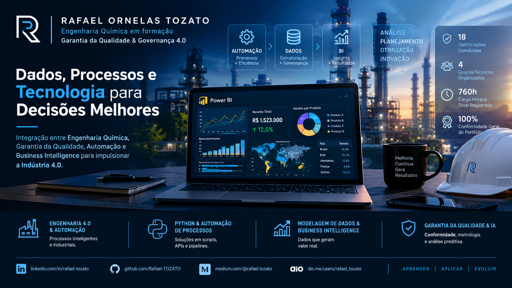

  

  
  
  
  
  

# Matriz de Competências e Desenvolvimento Profissional – 2026

> **AI Engineer | Especialista em Governança 4.0 e Qualidade | Engenheiro Químico**  
> [Mauá, SP](mailto:ornelas.tozato@gmail.com) | [LinkedIn](https://www.linkedin.com/in/rafaeltozato81) | [GitHub](https://github.com/Rafael-TOZATO) | [Portfólio PWA](https://tozato-dev-hub.vercel.app) | [Medium](https://medium.com/@ornelas.tozato)

Repositório técnico dedicado ao mapeamento estratégico de competências, direcionamento de carreira e consolidação das diretrizes de atuação em Garantia da Qualidade, Governança 4.0 e Transição para Inteligência Artificial.

---

## Visão Geral

Este espaço centraliza a documentação estruturada do planejamento de desenvolvimento profissional, alinhando rigor técnico, engenharia e análise de dados.

* **Documento Principal:** [Visualizar Matriz Atualizada em PDF](./Matriz-de-Desenvolvimento-Profissional-2026.pdf)

---

## Pilares de Atuação

* **Garantia da Qualidade:** Otimização de processos fabris e conformidade técnica.
* **Governança 4.0:** Gestão preditiva e integração de metodologias ágeis.
* **Data Analytics & IA:** Aplicação de ferramentas avançadas para tomada de decisão e automação de fluxos.

---

## Autor

**Rafael Ornelas Tozato**

Engenharia Química | Garantia da Qualidade | Governança 4.0

### Contato

- LinkedIn: [linkedin.com/in/rafaeltozato81](https://www.linkedin.com/in/rafaeltozato81)
- GitHub: [github.com/Rafael-TOZATO](https://github.com/Rafael-TOZATO)
- Medium: [medium.com/@ornelas.tozato](https://medium.com/@ornelas.tozato)
- Lovable: [aurora-bi-dio.lovable.app](https://aurora-bi-dio.lovable.app)
- 
